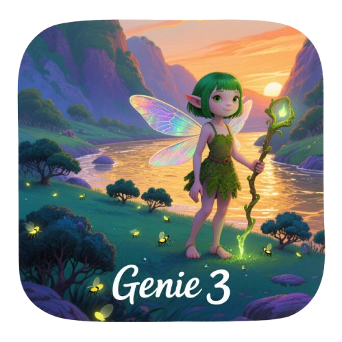

# 🧞‍♂️ Genie3 - AI虚拟世界生成器

<div align="center">



**使用AI技术瞬间创建令人惊叹的3D虚拟世界**

[](https://nextjs.org/)
[](https://reactjs.org/)
[](https://www.typescriptlang.org/)
[](https://threejs.org/)
[](https://tailwindcss.com/)

[🌐 在线演示](https://heightmap-terrain.vercel.app/) | [📖 文档](https://github.com/wuyu-wuhua/Genie3) | [🐛 问题反馈](https://github.com/wuyu-wuhua/Genie3/issues)

</div>

---

## ✨ 项目简介

Genie3 是一个革命性的AI驱动的3D虚拟世界生成器，能够将您的文字描述瞬间转换为令人惊叹的3D环境。无论是游戏开发者、设计师还是创意工作者，都能通过简单的文本输入创建复杂的3D场景。

### 🎯 核心特性

- **🤖 AI驱动生成** - 基于文本描述智能生成3D地形和环境
- **⚡ 实时预览** - 即时查看生成的3D世界，支持实时交互
- **🎨 多种地形类型** - 支持山脉、沙漠、海洋、森林等多种地形
- **🌍 多语言支持** - 完整的中英文双语界面
- **📱 响应式设计** - 完美适配桌面和移动设备
- **🎮 交互式控制** - 支持鼠标拖拽、缩放、旋转等操作

## 🚀 在线体验

**立即体验Genie3的强大功能：**

🌐 **[https://heightmap-terrain.vercel.app/](https://heightmap-terrain.vercel.app/)**

## 🛠️ 技术栈

### 前端框架
- **Next.js 13.5.1** - React全栈框架，支持SSR和SSG
- **React 18.2.0** - 用户界面库
- **TypeScript 5.2.2** - 类型安全的JavaScript

### 3D图形
- **Three.js 0.179.1** - 3D图形库
- **OrbitControls** - 相机控制
- **自定义着色器** - 高级地形渲染

### UI组件
- **Radix UI** - 无障碍组件库
- **Tailwind CSS 3.3.3** - 实用优先的CSS框架
- **Lucide React** - 现代图标库
- **Framer Motion** - 动画库

### 开发工具
- **ESLint** - 代码质量检查
- **PostCSS** - CSS后处理器
- **Autoprefixer** - CSS前缀自动添加

## 📦 安装与运行

### 环境要求
- Node.js 18.0 或更高版本
- npm 或 yarn 包管理器

### 快速开始

1. **克隆项目**
```bash
git clone https://github.com/wuyu-wuhua/Genie3.git
cd Genie3
```

2. **安装依赖**
```bash
npm install
# 或
yarn install
```

3. **启动开发服务器**
```bash
npm run dev
# 或
yarn dev
```

4. **打开浏览器**
访问 [http://localhost:3000](http://localhost:3000)

### 构建生产版本
```bash
npm run build
npm start
```

## 🎮 使用指南

### 基本操作

1. **访问生成器页面**
   - 点击首页的"开始生成"按钮
   - 或直接访问 `/generator` 路径

2. **输入描述**
   - 在文本框中输入您想要的3D世界描述
   - 例如："一个被白雪覆盖的山脉，有清澈的湖泊"

3. **选择地形类型**
   - 山脉 (Mountain) - 适合创建山峰和峡谷
   - 沙漠 (Desert) - 适合创建沙丘和荒漠
   - 海洋 (Ocean) - 适合创建波浪和水面
   - 森林 (Forest) - 适合创建树木和植被

4. **生成世界**
   - 点击"生成世界"按钮
   - 等待AI处理完成

5. **交互控制**
   - **鼠标左键拖拽** - 旋转视角
   - **鼠标滚轮** - 缩放
   - **鼠标右键拖拽** - 平移视角

### 高级功能

- **实时调整** - 生成后可以调整地形参数
- **材质切换** - 支持多种材质和纹理
- **光照控制** - 可调节环境光照和阴影
- **导出功能** - 支持导出3D模型和截图

## 🏗️ 项目结构

```
Genie3/
├── app/                    # Next.js 13 App Router
│   ├── about/             # 关于页面
│   ├── generator/         # 3D生成器页面
│   ├── privacy/          # 隐私政策
│   ├── terms/            # 服务条款
│   ├── globals.css       # 全局样式
│   ├── layout.tsx        # 根布局
│   └── page.tsx          # 首页
├── components/            # React组件
│   ├── ui/              # 基础UI组件
│   ├── Features.tsx     # 功能展示组件
│   ├── Hero.tsx         # 首页英雄区组件
│   ├── Navigation.tsx   # 导航组件
│   ├── WorldGenerator.tsx # 3D世界生成器
│   └── ...
├── lib/                  # 工具库
│   ├── translations/    # 多语言翻译
│   ├── utils.ts        # 工具函数
│   └── THREE.Terrain.min.js # Three.js地形库
├── hooks/               # 自定义Hooks
├── public/              # 静态资源
│   ├── images/         # 图片资源
│   └── lib/           # 公共库文件
└── ...
```

## 🌍 多语言支持

Genie3 支持完整的中英文双语界面：

- **中文** - 简体中文界面
- **English** - 英文界面

语言切换功能集成在导航栏中，用户可以随时切换界面语言。

## 🎨 自定义与扩展

### 添加新的地形类型

1. 在 `components/WorldGenerator.tsx` 中添加新的地形生成逻辑
2. 更新翻译文件以支持新地形的描述
3. 在UI中添加相应的选择选项

### 自定义材质

1. 在 `lib/` 目录下添加新的材质文件
2. 更新着色器代码以支持新的渲染效果
3. 在生成器中集成新的材质选项

## 🤝 贡献指南

我们欢迎所有形式的贡献！

### 如何贡献

1. **Fork 项目**
2. **创建功能分支** (`git checkout -b feature/AmazingFeature`)
3. **提交更改** (`git commit -m 'Add some AmazingFeature'`)
4. **推送到分支** (`git push origin feature/AmazingFeature`)
5. **创建 Pull Request**

### 贡献类型

- 🐛 Bug修复
- ✨ 新功能开发
- 📝 文档改进
- 🎨 UI/UX优化
- 🌍 多语言支持
- ⚡ 性能优化

## 📄 许可证

本项目采用 MIT 许可证 - 查看 [LICENSE](LICENSE) 文件了解详情。

## 🙏 致谢

- [Three.js](https://threejs.org/) - 强大的3D图形库
- [Next.js](https://nextjs.org/) - React全栈框架
- [Tailwind CSS](https://tailwindcss.com/) - 实用优先的CSS框架
- [Radix UI](https://www.radix-ui.com/) - 无障碍组件库
- [Vercel](https://vercel.com/) - 部署平台

## 📞 联系我们

- **GitHub**: [https://github.com/wuyu-wuhua/Genie3](https://github.com/wuyu-wuhua/Genie3)
- **在线演示**: [https://heightmap-terrain.vercel.app/](https://heightmap-terrain.vercel.app/)
- **问题反馈**: [GitHub Issues](https://github.com/wuyu-wuhua/Genie3/issues)

---

<div align="center">

**⭐ 如果这个项目对您有帮助，请给我们一个星标！**

Made with ❤️ by [wuyu-wuhua](https://github.com/wuyu-wuhua)

</div> 